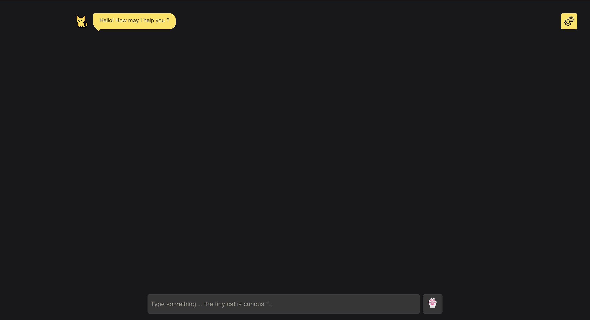

# Le petit chat

A minimal, delightful chat interface built with **Next.js** and powered by the **Mistral API**.
“Le Petit Chat” answers your questions — sometimes thoughtfully, sometimes playfully. 🐾

## Preview
[Live Demo here](https://le-petit-chat.vercel.app/)

### Light Mode

### Dark Mode



## Installation

1. Clone the repo  
```sh
git clone https://github.com/ton-user/le-petit-chat.git
cd le-petit-chat
```

2. Install dependencies
```sh
npm install
# or
pnpm install
```

3. Run the app
```sh
npm run dev
```

Then open http://localhost:3000
 — and say bonjour to Le Petit Chat 🐾


## API Key Setup

To chat with Le Petit Chat, you’ll need a Mistral API key 🪄

### Step 0 — Generate your API key (Prerequirements)

1. Go to the [Mistral Platform](https://console.mistral.ai).

2. Sign in or create an account.

3. Navigate to API Keys → Generate new key.

4. Copy your new key.

### Step 1 — Save it in the app

1. Launch Le Petit Chat locally.

2. Click the Settings icon (top-right corner).

3. Paste your Mistral API key in the input field and press Send.

Your key is stored locally in your browser’s sessionStorage — it is never shared or uploaded anywhere.

## Roadmap
- Message history persistence
- Model selector (Mistral 7B / Mixtral)
- “Copy code” button in chat bubbles
- Improved Markdown rendering